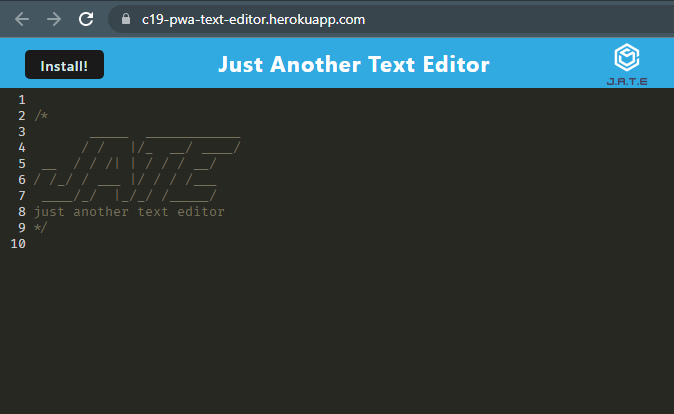
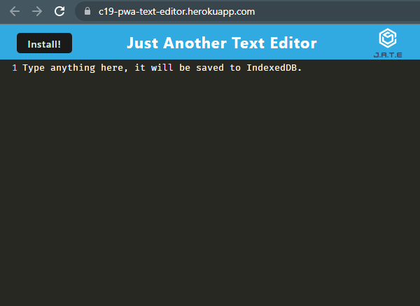
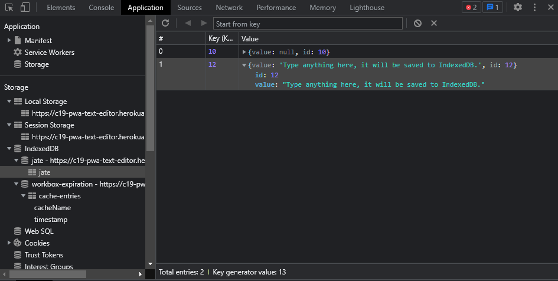

# c19-pwa-text-editor
UT Coding Bootcamp Challenge 19: Progressive Web App (PWA) Text Editor

## Description

> Your task is to build a text editor that runs in the browser. The app will be a single-page application that meets the PWA criteria. Additionally, it will feature a number of data persistence techniques that serve as redundancy in case one of the options is not supported by the browser. The application will also function offline.

## Table of Contents

- [Installation](#installation)
- [Usage](#usage)
- [Credits](#credits)
- [License](#license)

## Installation

https://c19-pwa-text-editor.herokuapp.com/ 

## Usage

## Credits

Study group - 
- Harrison - https://github.com/harrisonboatman
- Connor - https://github.com/connorbodin
- Darren - https://github.com/medranomiler 
- Rick - https://github.com/Rick3Mrtz

- Starter Code provided by instructor

Full-Stack Blog - [Professional README Guide](https://coding-boot-camp.github.io/full-stack/github/professional-readme-guide)

## License

Please see LICENSE file.

---

